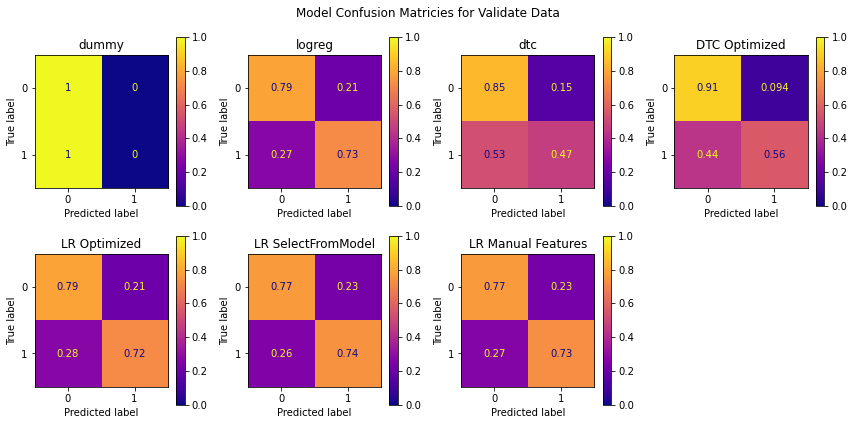

# H1N1 Vaccination Survey Results Project

Students: Will Bennett

Teacher: David Elliot

Project Due Date: June 2nd

## Project Overview
The purpose of this project is to apply machine learning concepts to a real world dataset. I chose the H1N1 project because of my interest in healthcare. 

This is a classification project using the two models that we have learned so far in the course, Logistic Regression and Decision Tree. 

This project will be using survey data from a [ML competition](https://www.drivendata.org/competitions/66/flu-shot-learning/) to develop a model to predict whether or not the survey respondant recieved the H1N1 vaccine. 

## Business Undertanding
I created a hypothetical situation where the ACME coperation public health subsidiary is investigating how to direct its vaccine awareness efforts for a new epedemic the H3N4 virus. 

## Model Results
I compared 7 different models including 3 baseline models, here are the results:

**Confusion Matricies**



**Key Scores**


**ROC Curves**


The final model was the DTC optimized model because of the lower false positives and the high AUC value

## Business Recommendations

1. Reach out to healthcare professionals to encourage them to recommend their patients get vaccinated
2. Send out a survey to people to collect key datapoints including percieved risk and income
3. Prioritize reducing false positives for model creation since saving lives is the priority

## Next Steps

1. Improve the model performance using new model types
2. Get more data from different epidemics to compare

## Repository Structure

```
├── README.md
├── index.ipynb (main python file)
├── presentation.pdf
└── images
```
